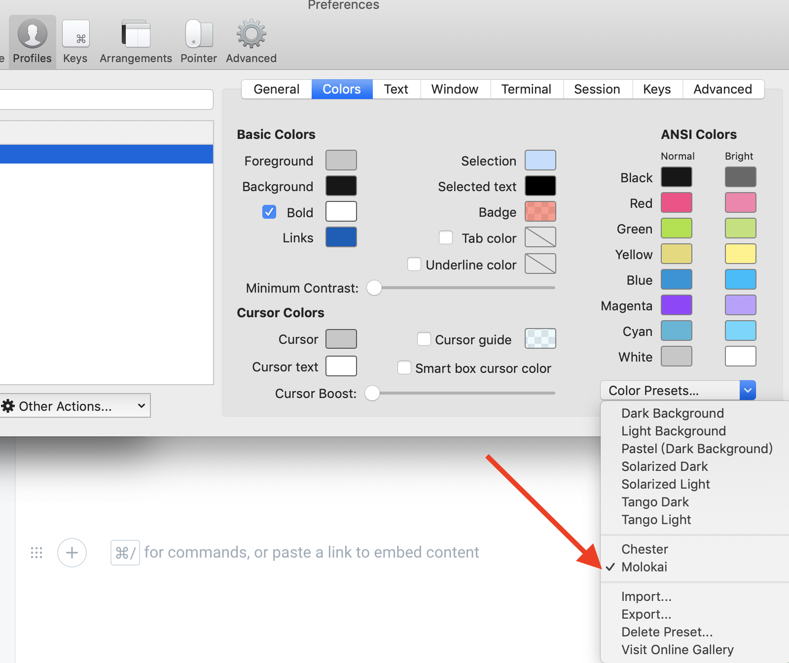
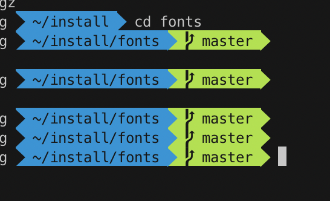

# 切换配色

点开下面的网址，下载配色，（有tar.gz 和 zip 两种压缩方式，随便下载一个）



下载的时候，可以在这个网页浏览一下，挑选出自己喜欢的一款配色。我个人比较喜欢**Monlokai**

下载完成后，解压缩。然后点开iterm的偏好设置，引入颜色配置

**找到刚刚下载后解压的文件，-&gt; schemes  -&gt;   Molokai.itermcolors ,然后点击open**

**然后在偏好设置中选择“Molokai”**

**效果如下**

\*\*\*\*

